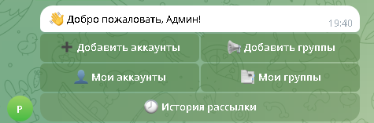
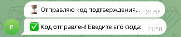
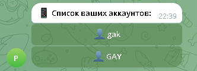
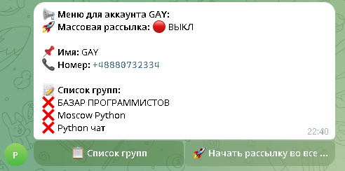
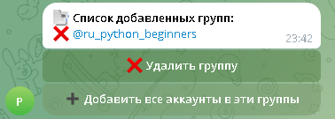

📌 Бот для рассылки сообщений
---
Это бот для рассылки массовых сообщений в телеграмм
## 📦 Установка и Запуск
1. Установите зависимости через консоль:
   ```bash
   pip install -r requirements.txt
   ```
2. Получите API_ID и API_HASH на сайте телеграмма
3. Получите токен бота у @BotFather
4. Настройте конфиг:
   Заполните `.env`:
   ```dotenv
    API_ID=Ваш API_ID
    API_HASH=Ваш API_HASH
    BOT_TOKEN=Ваш токен бота
   ```
5. Получите id вашего(-их) аккаунтов в телеграмм
6. Настройте файл config.py:
   ```python
   from decouple import config

   API_ID = int(config("API_ID"))
   API_HASH = config("API_HASH")
   BOT_TOKEN = config("BOT_TOKEN")
   ADMIN_ID_LIST = []  # <-- Вставить ID разрешенных телеграмм аккаунтов через запятую
   
   ```
7. 🖥 Запустите файл main.py через интерфейс **IDE** или через консоль:
   ```bash
   python main.py
   ```
---

# Действия в боте
---
## Добавление Аккаунта
1. Откройте бота и нажмите ```/start``` :

2. Выберете пункт **Добавть аккаунт** и введите ваш номер телефона

3. Введите код подтверждения отправленный в теллеграмм

4. Введите пароль от аккаунта если у вас он установлен 
---
## Просмотр аккаунтов
1. Откройте бота и нажмите ```/start``` :

2. Выберете пункт **Мои аккаунты**
3. Вам Отобразятся список ваших аккаунтов:

4. Выберете аккаунт который вы хотите просмотреть и нажмите на пункт в списке
5. Вам отобразится информация об аккаунте
 Вам будет показана информация об аккаунте и группах
---
## Добавления группы
1. Откройте бота и нажмите ```/start``` :

2. Выберете пункт **Добавить группу**
3. Введите ***username*** группы:

---
## Просмотр групп
1. Откройте бота и нажмите ```/start``` :

2. Выберете пункт **Мои группы**

Вам откроектся список всех ваших группы
